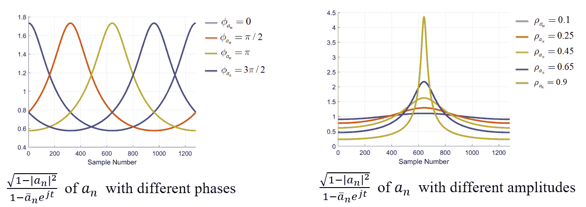

.. _introductionAFD-label:

Introduction to Adaptive Fourier Decomposition
=====================================================================

The adaptive Fourier decomposition is an **adaptive** signal decomposition:

+ Compared with the conventional signal decomposition methods, e.g. Fourier decomposition and wavelet decomposition, the AFD uses **adaptive orthogonal basis**. These adaptive basis can make the decomposition components match the processed signals best and thus can provide good time-frequency resolution without pre-defined basis. 
+ Compared with other adaptive decomposition methods, e.g. empirical mode decomposition (EMD), the AFD has the **rigorous mathematical foundation**, which allowed users further analyze detailed decomposition coefficients and decomposition components.

Basic Idea
-------------

The AFD decomposes the processed signal :math:`g(t)` to a series of orthogonal signals, which can be expressed as

.. math::

   g(t) = \sum_{n=1}^\infty A_n B_n(t),

where :math:`A_n` is the decomposition coefficient, :math:`B_n(t)` is the decomposition basis component, and :math:`n` denotes the decomposition level. The decomposition is from :math:`n=1` to :math:`n=\infty`. In each decomposition level, a suitable basis component is generated adaptively to make sure that the corresponding decomposition component matches the processed signal best. In other words, the AFD applies `matching pursuit <https://en.wikipedia.org/wiki/Matching_pursuit>`_ process to provide a **sparse** approximation of the processed signal. 

Decomposition Basis
----------------------

The AFD uses the rational orthogonal system :math:`\left\{B_n\right\}_{n=1}^\infty` as its basis where

.. math::

   B_n(t)=\frac{\sqrt{1-\left| a_n \right|^2}}{1-\overline{a}_ne^{jt}}\prod_{k=1}^{n-1}\frac{e^{jt}-a_k}{1-\overline{a}_ke^{jt}}.

It should be noticed that, in the decomposition level :math:`n`, the basis component :math:`B_n` is only determined by :math:`\left\{a_k\right\}_{k=1}^n`. Suppose parameters :math:`a_k` from :math:`k=1` to :math:`k=n-1` have been obtained in previous decomposition levels, only :math:`a_n` needs to be found in the decomposition level :math:`n`. 

The basis parameter :math:`a_n` is defined in the unit circle :math:`\mathbb{D}` of the complex plane :math:`\mathbb{C}` where :math:`\mathbb{D}=\left\{ z\in\mathbb{C}: \left| z \right|<1 \right\}`. The effects of :math:`a_n` for :math:`B_n(t)` are similar as the effects of shift and scaling factors for the wavelet decomposition as shown in the following figure. Moreover, when :math:`a_1= \cdots =a_n=0`, the basis component of the AFD becomes the basis component of the conventional Fourier decomposition. 

Basic Decomposition Process
----------------------

As mentioned in `Basic Idea`_, the decomposition of the AFD is a matching pursuit process. Therefore, in the decomposition level :math:`n`, the basis parameter :math:`a_n` is searched to maximize the extracted energy :math:`\left< g(t),B_n(t) \right>`. 

Applications
-----------------

According to above characteristics, the AFD can applied to many different areas:

+ Adaptive feature extraction (for further signal classification or recognition)

   + Z. Ye, T. Qian, L. Zhang, L. Dai, H. Li, J.A. Benediktsson,"`Functional Feature Extraction for Hyperspectral Image Classification With Adaptive Rational Function Approximation <https://ieeexplore.ieee.org/document/9340564>`_," IEEE Trans. Geosci. Remote Sens., pp. 1–15, 2021.
   + C. Ke, Q. Huang, L. Zhang, and Y. Fang, "`Modeling head-related impulse response based on adaptive Fourier decomposition <https://ieeexplore.ieee.org/document/8228391>`_," in TENCON 2017 - 2017 IEEE Region 10 Conference, Penang, Nov. 2017, pp. 3084–3088.

+ Signal compression: 
  
  + C. Tan, L. Zhang, H. Wu,"`A Novel Blaschke Unwinding Adaptive Fourier Decomposition based Signal Compression Algorithm with Application on ECG Signals <https://ieeexplore.ieee.org/stamp/stamp.jsp?arnumber=8322131>`_," IEEE J. Biomed. Heal. Informatics, Mar. 2018.
  + J. Ma, T. Zhang, and M. Dong, "`A novel ECG data compression method using adaptive Fourier decomposition with security guarantee in e-health applications <http://ieeexplore.ieee.org/document/6897915/>`_," IEEE J. Biomed. Heal. Informatics, vol. 19, no. 3, pp. 986–994, 2015.

+ Signal denoising:

   + Z. Wang, F. Wan, C. M. Wong, and L. Zhang, "`Adaptive Fourier decomposition based ECG denoising <http://www.sciencedirect.com/science/article/pii/S0010482516302104>`_," Comput. Biol. Med., vol. 77, pp. 195–205, 2016.
   + Z. Wang, C. M. Wong, F. Wan, "`Adaptive Fourier decomposition based R-peak detection for noisy ECG Signals <https://ieeexplore.ieee.org/abstract/document/8037611/>`_," in 39th Annual International Conference of the IEEE Engineering in Medicine and Biology Society (EMBC), 2017, pp. 3501-3504.
   + Z. Wang, C. M. Wong, J. N. da Cruz, F. Wan, P.-I. Mak, P. U. Mak, and M. I. Vai, "`Muscle and electrode motion artifacts reduction in ECG using adaptive Fourier decomposition <http://ieeexplore.ieee.org/document/6974120/>`_," in 2014 IEEE International Conference on Systems, Man, and Cybernetics (SMC), 2014, pp. 1456–1461.
   + Z. Wang, J. Nuno da Cruz, and F. Wan, "`Adaptive Fourier decomposition approach for lung-heart sound separation <http://ieeexplore.ieee.org/document/7158631/>`_," in 2015 IEEE International Conference on Computational Intelligence and Virtual Environments for Measurement Systems and Applications (CIVEMSA), 2015, pp. 1–5.

+ Model estimation:

   + Q. Chen, T. Qian, Y. Li, W. Mai, X. Zhang, "`Adaptive Fourier tester for statistical estimation <https://doi.org/10.1002/mma.3795>`_," Math. Method. Appl. Sci., vol. 39, no. 12, pp. 3478–3495, 2016.
   + W. Mi and T. Qian, "`Frequency-domain identification: An algorithm based on an adaptive rational orthogonal system <http://www.sciencedirect.com/science/article/pii/S0005109812000982>`_," Automatica, vol. 48, no. 6, pp. 1154–1162, 2012.

+ Time-frequency analysis:

   + L. Zhang, "`Adaptive Fourier decomposition based signal instantaneous frequency computation approach <http://waset.org/publications/2536/adaptive-fourier-decomposition-based-signal-instantaneous-frequency-computation-approach>`_," Int. J. Math. Comput. Phys. Electr. Comput. Eng., vol. 6, no. 8, pp. 1117–1122, 2012.

   Related Papers
   -----------------

   + T. Qian, "`Intrinsic mono-component decomposition of functions: an advance of Fourier theory <https://doi.org/10.1002/mma.1214>`_," Math. Methods Appl. Sci., vol. 33, no. 7, pp. 880–891, 2010.
   + T. Qian, L. Zhang, and Z. Li, "`Algorithm of adaptive Fourier decomposition <http://ieeexplore.ieee.org/document/6021385/>`_," IEEE Trans. Signal Process., vol. 59, no. 12, pp. 5899–5906, 2011.
   + T. Qian and Y. Wang, "`Remarks on adaptive Fourier decomposition <http://www.worldscientific.com/doi/pdf/10.1142/S0219691313500070>`_," Int. J. Wavelets, Multiresolution Inf. Process., vol. 11, no. 1, p. 1350007, 2013.
   + T. Qian, "`Cyclic AFD algorithm for the best rational approximation <https://doi.org/10.1002/mma.2843>`_," Math. Methods Appl. Sci., vol. 37, no. 6, pp. 846–859, 2014.
   + T. Qian, "`Adaptive Fourier decompositions and rational approximations — part I: Theory <http://www.worldscientific.com/doi/pdf/10.1142/S0219691314610086>`_," Int. J. Wavelets, Multiresolution Inf. Process., vol. 12, no. 5, p. 1461008, 2014.
   + L. Zhang, W. Hong, W. Mai, and T. Qian, "`Adaptive Fourier decomposition and rational approximation — part II: Software system design and development <http://www.worldscientific.com/doi/pdf/10.1142/S0219691314610098>`_," Int. J. Wavelets, Multiresolution Inf. Process., vol. 12, no. 5, p. 1461009, 2014.
   + T. Qian, H. Li, and M. Stessin, "`Comparison of adaptive mono-component decompositions <http://www.sciencedirect.com/science/article/pii/S1468121812001770>`_," Nonlinear Anal. Real World Appl., vol. 14, no. 2, pp. 1055–1074, 2013.
   + Y. Gao, M. Ku, T. Qian, and J. Wang, "`FFT formulations of adaptive Fourier decomposition <http://www.sciencedirect.com/science/article/pii/S0377042717302005>`_," J. Comput. Appl. Math., Apr. 2017.
   + Z. Wang, F. Wan, C. M. Wong, and T. Qian, "`Fast basis search for adaptive Fourier decomposition <https://link.springer.com/article/10.1186/s13634-018-0593-1>`_," EURASIP J. Adv. Sig. Pr., vol. 74, no. 1, 2018.